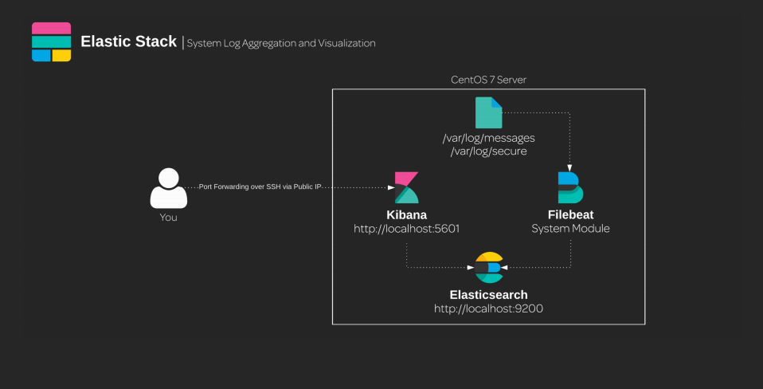

## Install JAVA

```bash
 sudo yum install java-1.8.0-openjdk
```

## Install ElasticSearch

```bash
 sudo rpm --import https://artifacts.elastic.co/GPG-KEY-elasticsearch
 sudo rpm -i https://artifacts.elastic.co/downloads/elasticsearch/elasticsearch-6.2.3.rpm
```

### Enable elasticSearch

```bash
 sudo systemctl daemon-reload
 sudo systemctl enable elasticsearch
 sudo systemctl start elasticsearch
```

## Install Kibana

```bash
 sudo rpm -i https://artifacts.elastic.co/downloads/kibana/kibana-6.2.3-x86_64.rpm
```

### Enable Kibana

```bash
 sudo systemctl enable kibana
 sudo systemctl start kibana
```


## Install FileBeat

```bash
 sudo rpm -i https://artifacts.elastic.co/downloads/beats/filebeat/filebeat-6.2.3-x86_64.rpm
 sudo vim /etc/filebeat/modules.d/system.yml.disabled
 sudo mv /etc/filebeat/modules.d/system.yml.disabled /etc/filebeat/modules.d/system.yml
 sudo filebeat modules enable system
 sudo /usr/share/elasticsearch/bin/elasticsearch-plugin install ingest-geoip
```

```bash
 sudo systemctl restart elasticsearch
```

### Enable Kibana
```bash
sudo filebeat setup
sudo systemctl enable filebeat
sudo systemctl start filebeat
```
